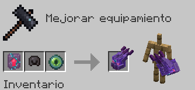
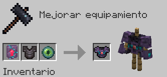
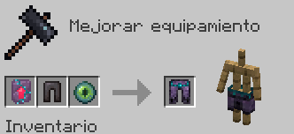
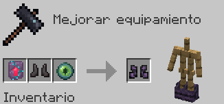
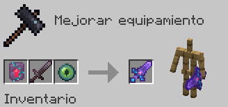
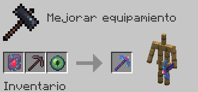
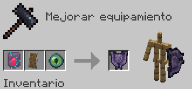

# Sugilita

Fabricar el Set de Armadura de Sugilita da el siguiente efecto al equiparse el Peto:

* **Prisa minera I permanente**

| Objeto                                                                          | Fabricación del objeto                                                            | Extras                                                                                                                                        |
| ------------------------------------------------------------------------------- | --------------------------------------------------------------------------------- | --------------------------------------------------------------------------------------------------------------------------------------------- |
|  **Mejora de Sugilita**  | Cómpralo en `/warp esencias` por **150 Esencias** y **10 Ojos de ender** |                                                                                                                                               |
|  **Casco de Sugilita**    |                                | El Casco se fabrica con el encantamiento ya aplicado de **Protección IV**                                                                     |
|  **Peto de Sugilita** |                                 | Esta pieza es irrompible                                                                                                                      |
|  **Grebas de Sugilita** |                               | Esta pieza es irrompible                                                                                                                      |
|  **Botas de Sugilita**     |                                | Esta pieza es irrompible                                                                                                                      |
|  **Espada de Sugilita**    |                               | La Espada se fabrica con el encantamiento ya aplicado de **Aspecto Helado I** _(Congela y envenena enemigos al golpear)_            |
|  **Pico de Sugilita**    |                                 | El Pico se fabrica con el encantamiento ya aplicado de **Túnel I** _(Mina varios bloques a la vez)_ |
|  **Escudo de Sugilita**   |                               | El Escudo es puramente estético                                                                                                               |
---
# Mejorar Pico de Sugilita
**Es posible mejorar el encantamiento de Túnel I del Pico de Sugilita hasta el Nivel III**. Sigue estos pasos para llegar al nivel máximo:

## Mejora a Nivel II
Consigue los siguientes objetos para poder empezar la mejora a Nivel II:

| Objeto | Obtención |
| - | - |
| **Núcleo de Fragmento Resonante** | Cómpralo en `/warp esencias` por **10**  **Fragmentos Resonantes**. |
|  **Mejora de Sugilita**  | Cómpralo en `/warp esencias` por **150 Esencias** y **10 Ojos de ender** |
|  **Pico de Sugilita** _(con Túnel I)_ |  |

Una vez obtenido los objetos, aplícalos en una Mesa de Herrería para crear el **Pico de Sugilita II** _(con Túnel II)_.

## Mejora a Nivel III
Consigue los siguientes objetos para poder empezar la mejora a Nivel II:

| Objeto | Obtención |
| - | - |
| **Ultra-Núcleo de Fragmento Resonante** | Cómpralo en `/warp esencias` por **3**  **Núcleos de Fragmento Resonante**. |
|  **Mejora de Sugilita**  | Cómpralo en `/warp esencias` por **150 Esencias** y **10 Ojos de ender** |
|  **Pico de Sugilita II** _(con Túnel II)_ | *Explicado en la sección anterior* |

Una vez obtenido los objetos, aplícalos en una Mesa de Herrería para crear el **Pico de Sugilita III** _(con Túnel III)_. <u>Esta es la última mejora posible.</u>