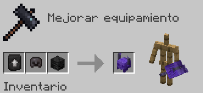
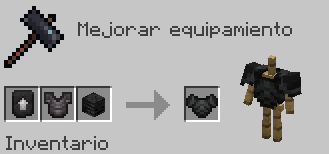
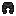
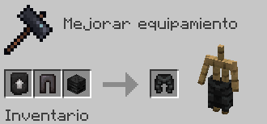
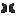
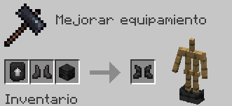
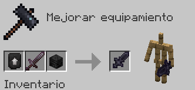
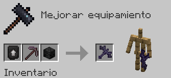
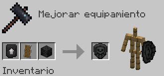

# Wither

Fabricar el Set de Armadura de Wither da el siguiente efecto al equiparse el Peto:

* **Cuerpo ignífugo II permanente**

| Objeto                                                                          | Fabricación del objeto                                                            | Extras                                                                                                                                        |
| ------------------------------------------------------------------------------- | --------------------------------------------------------------------------------- | --------------------------------------------------------------------------------------------------------------------------------------------- |
|  **Mejora de Wither**  | Cómpralo en `/warp esencias` por **150 Esencias** y **5 Calaveras de Wither** |                                                                                                                                               |
|  **Casco de Wither**    |                                | El Casco se fabrica con el encantamiento ya aplicado de **Protección IV**                                                                     |
|  **Peto de Wither** |                                 | Esta pieza es irrompible                                                                                                                      |
|  **Grebas de Wither** |                               | Esta pieza es irrompible                                                                                                                      |
|  **Botas de Wither**     |                                | Esta pieza es irrompible                                                                                                                      |
|  **Espada de Wither**    |                               | La Espada se fabrica con el encantamiento ya aplicado de **Perdición del Infierno I** _(Inflinge más de daño a enemigos del Nether)_            |
|  **Pico de Wither**    |                                 | El Pico se fabrica con el encantamiento ya aplicado de **Fundición I** _(Funde bloques minados con cierta probabilidad)_ |
|  **Escudo de Wither**   |                               | El Escudo es puramente estético                                                                                                               |
