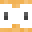
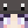

# 🛠️ Equipo de Staff — Universo PokéNet

En **[Universo PokéNet](../README.md)** contamos con un equipo especializado para garantizar la mejor experiencia dentro del servidor. A continuación, puedes consultar los integrantes de nuestro equipo, sus roles y rangos.

---

## 👑 Dueño

> **Encargado de la gestión general, visión estratégica y decisiones finales del servidor.**

| Avatar | Nick | Cargo |
| :---: | :--- | :---: |
|  | **PokeSantiTW** | `Dueño` |

---

## ⚡ Administradores

> **Máxima autoridad operativa sobre el servidor, responsables de la toma de decisiones clave.**

| Avatar | Nick | Cargo |
| :---: | :--- | :---: |
|  | **YamatoDust** | `Administrador Líder` |
|  | **xFuriadaNoitex** | `Administrador Líder` |
|  | **Mai_075** | `Admin` |
|  | **Gamertito** | `Admin` |

---

## 🛡️ Moderadores

> **Encargados de mantener el orden, aplicar sanciones y asegurar la armonía en la comunidad.**

| Avatar | Nick | Cargo |
| :---: | :--- | :---: |
|  | **Juniorcx** | `Moderador` |
|  | **ITSFrankoGG** | `Moderador` |
|  | **Teyu_31** | `Moderador` |
|  | **RivalSilver97** | `Moderador` |

---

## 🤝 Helpers

> **Soporte directo a la comunidad: resolución de dudas, guía e inicio para nuevos jugadores.**

| Avatar | Nick | Cargo |
| :---: | :--- | :---: |
|  | **Trolendo** | `Helper` |
|  | **Ikaros_YT** | `Helper` |
|  | **IMarioCrack** | `Helper` |
|  | **Morcant_** | `Helper` |
|  | **yThmks_** | `Helper` |
|  | **TRANSLATOR** | `Helper` |

---

## 💻 Developers

> **Ingenieros del servidor: programación de plugins, bots e integración de nuevas mecánicas.**

| Avatar | Nick | Cargo |
| :---: | :--- | :---: |
|  | **Marukuz** | `Developer` |
|  | **Cheminsky** | `Developer` |
|  | **MiNombreEsVaro** | `Developer` |
|  | **raptor654** | `Developer` |

---

## 🧱 Builders

> **Arquitectos de PokéNet: construcción de mapas, spawns, zonas de misiones y eventos.**

| Avatar | Nick | Cargo |
| :---: | :--- | :---: |
|  | **ITSFrankoGG** | `Builder Líder` |
|  | **xFuriadaNoitex** | `Builder` |
|  | **Trolendo** | `Builder` |
|  | **Gamertito** | `Builder` |
|  | **Mai_075** | `Builder` |
|  | **Arii** | `Builder` |
|  | **yThmks_** | `Builder` |

---

## 🎨 Equipo Creativo

> **Artistas visuales: creación de texturas, modelos 3D, skins, armaduras y arte promocional.**

| Avatar | Nick | Cargo |
| :---: | :--- | :---: |
|  | **Mai_075** | `Directora Creativa` |
|  | **xFuriadaNoitex** | `Creativo` |
|  | **YamatoDust** | `Creativo` |
|  | **EnzuoGa** | `Creativo` |
|  | **rowlex** | `Creativo` |
|  | **raptor654** | `Creativo` |
