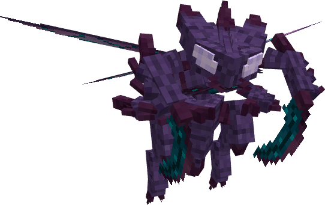
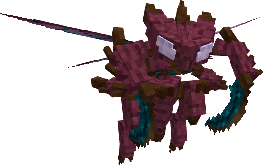

# 🐉 Línea Evolutiva: Abyssect

---

## 1. Abyssect (Nº 2006)

### Información

**Abyssect** es un Pokémon de tipo [dragón](https://www.wikidex.net/wiki/Tipo_dragón)/[bicho](https://www.wikidex.net/wiki/Tipo_bicho) introducido en la [Temporada Gen X]. Es conocido por ser un depredador implacable en el servidor Universo Pokénet.

| **Artwork** |  |
| :---: | :--- |
| **Tipos** |   |
| **Habilidades** | [Swarm](https://www.wikidex.net/wiki/Enjambre) [Intimidate](https://www.wikidex.net/wiki/Intimidación) |
| **Hab. oculta** | **Abyssalcore** |
| **Grupo Huevo** | [Bicho](https://www.wikidex.net/wiki/Tipo_bicho) / [Dragón](https://www.wikidex.net/wiki/Tipo_dragón) |
| **Evoluciona a** | Mega-Abyssect (Megaevolución) |
| **Creado por** | Universo Pokénet |

### Descripción (Lore)
Abyssect: Una manifestación de poder antiguo que combina la ferocidad de los dragones con la adaptabilidad de los insectos. Su núcleo abisal pulsa con una energía oscura que le permite ejecutar movimientos rápidos y letales, siendo una de las criaturas más temidas de su hábitat.

### Características base

Las [características base](https://www.wikidex.net/wiki/Caracter%C3%ADsticas) de Abyssect son las siguientes:

| Stat | Valor | Barra de Progreso (Visual) |
| :--- | :---: | :--- |
| **HP** | **107** | ████████░░░░░░ |
| **Ataque** | **135** | ██████████░░░░ |
| **Defensa** | **80** | ██████░░░░░░░░ |
| **At. Especial** | **70** | █████░░░░░░░░░ |
| **Def. Especial** | **85** | ██████░░░░░░░░ |
| **Velocidad** | **123** | █████████░░░░░ |
| **TOTAL** | **600** | |

### Movimientos



| Nivel | Movimiento | Tipo |
| :---: | :---: | :---: |
| 1 | [Leer](https://www.wikidex.net/wiki/Malicioso) |  |
| 1 | [Scratch](https://www.wikidex.net/wiki/Arañazo) |  |
| 12 | [Dragon Breath](https://www.wikidex.net/wiki/Dragoaliento) |  |
| 30 | [U-Turn](https://www.wikidex.net/wiki/Ida_y_vuelta) |  |
| 42 | [First Impression](https://www.wikidex.net/wiki/Escaramuza) |  |
| 48 | [Dragon Claw](https://www.wikidex.net/wiki/Garra_dragón) |  |
| 52 | **Abyssrend** |  |
| 58 | [Outrage](https://www.wikidex.net/wiki/Enfado) |  |



| Movimiento | Tipo | Movimiento | Tipo |
| :---: | :---: | :---: | :---: |
| [Lunge](https://www.wikidex.net/wiki/Plancha) |  | [Night Slash](https://www.wikidex.net/wiki/Tajo_noche) |  |
| [Sucker Punch](https://www.wikidex.net/wiki/Golpe_bajo) |  | [Sticky Web](https://www.wikidex.net/wiki/Red_pegajosa) |  |
| [Dragon Rush](https://www.wikidex.net/wiki/Carga_dragón) |  | | |



| Movimiento | Tipo | Movimiento | Tipo | Movimiento | Tipo |
| :---: | :---: | :---: | :---: | :---: | :---: |
| [Swords Dance](https://www.wikidex.net/wiki/Danza_espada) |  | [Iron Head](https://www.wikidex.net/wiki/Cabeza_de_hierro) |  | [X-Scissor](https://www.wikidex.net/wiki/Tijera_X) |  |
| [Draco Meteor](https://www.wikidex.net/wiki/Cometa_draco) |  | [Crunch](https://www.wikidex.net/wiki/Triturar) |  | [Tera Blast](https://www.wikidex.net/wiki/Teraexplosión) |  |



---

## 2. Mega-Abyssect (Nº 2006)

### Información

**Mega-Abyssect** es la forma potenciada de Abyssect. Su peso aumenta considerablemente a 120.0 kg y su escala visual crece para imponer su dominio en combate.

| **Artwork** |  |
| :---: | :--- |
| **Tipos** |   |
| **Habilidad** | **Abyssalcore** |
| **Hab. oculta** | **Abyssalcore** |
| **Grupo Huevo** | [Bicho](https://www.wikidex.net/wiki/Tipo_bicho) / [Dragón](https://www.wikidex.net/wiki/Tipo_dragón) |
| **Evoluciona de** | Abyssect (Megaevolución) |
| **Creado por** | Universo Pokénet |

### Descripción (Lore)
Mega-Abyssect: La energía de la megaevolución ha sobrecargado su núcleo abisal, otorgándole una fuerza física capaz de desgarrar dimensiones. Su armadura de quitina se refuerza y sus alas vibran a una frecuencia que intimida a cualquier oponente, convirtiéndolo en el máximo exponente de su línea evolutiva.

### Características base

Tras la megaevolución, sus [características base](https://www.wikidex.net/wiki/Caracter%C3%ADsticas) aumentan significativamente:

| Estadística | Valor |
| :---: | :---: |
| PS | 107 |
| Ataque | 165 |
| Defensa | 100 |
| At. esp | 90 |
| Def. esp | 95 |
| Velocidad | 143 |
| **Total** | **700** |

### Movimientos

*Mega-Abyssect mantiene el acceso a todos los movimientos de su forma base, potenciando su efectividad gracias a su incremento masivo en Ataque y Velocidad.*



| Movimiento | Tipo | Descripción |
| :---: | :---: | :--- |
| **Abyssrend** |  | Movimiento característico potenciado por su nueva forma. |
| **First Impression** |  | Ideal para golpear primero con una fuerza devastadora de 165 de Ataque base. |
| **Swords Dance** |  | Permite alcanzar niveles de daño insuperables en pocos turnos. |


