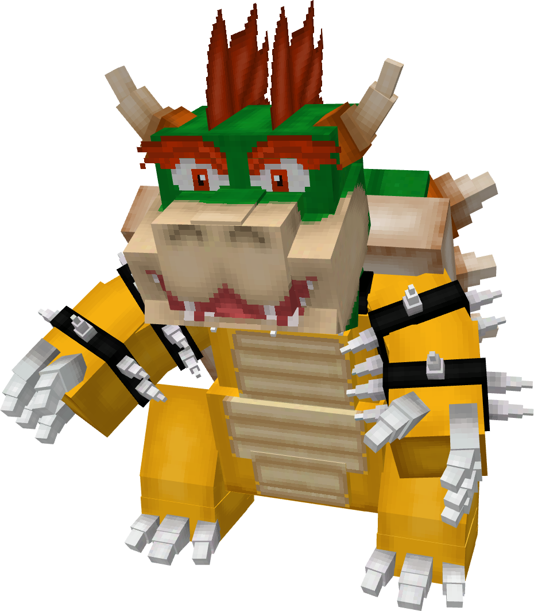

# 🐉 Abyssect #2006

## Abyssect (Nº ????) - Forma Macho

### Información

**Abyssect** es un Pokémon de tipo [bicho](https://www.wikidex.net/wiki/Tipo_siniestro)/[Dragón](https://www.wikidex.net/wiki/Tipo_lucha) introducido en la [Temporada Glitch]. Es un atacante físico extremadamente rápido con un total de **600** puntos de estadísticas base.

| **Artwork** |  |
| :---: | :--- |
| **Tipos** |   |
| **Habilidades** | [Defiant](https://www.wikidex.net/wiki/Competitivo) [Unburden](https://www.wikidex.net/wiki/Liviano) |
| **Hab. oculta** | [Sharpness](https://www.wikidex.net/wiki/Cortante) |
| **Grupos Huevo** | [Bicho](https://www.wikidex.net/wiki/Grupo_bicho), [Humanoide](https://www.wikidex.net/wiki/Grupo_humanoide) |
| **Evoluciona de** | Chryseil (Nivel 32, Hembra) |
| **Creado por** | FuriadaNoite |

### Descripción (Lore)
Silkorn: Esta forma es la encarnación de la destreza y la gracia letal. Más alta y esbelta, Silkorn ha refinado la fusión, utilizando el Vacío solo como núcleo de poder mientras teje la Seda en una armadura ligera y flexible que permite una agilidad acrobática. Armada con una 'aguja' quitinosa, Silkorn no solo usa la seda; la comanda, lanzando hilos para moverse y atacar. No es un espectro silencioso, sino una bailarina orgullosa, una protectora de su territorio que danza en la oscuridad.

### Características base

| Estadística | Valor |
| :---: | :---: |
| PS | 70 |
| Ataque | 125 |
| Defensa | 60 |
| At. esp | 80 |
| Def. esp | 75 |
| Velocidad | 110 |
| **Total** | **541** |

### Movimientos



| Nivel | Movimiento | Tipo | Nivel | Movimiento | Tipo |
| :---: | :---: | :---: | :---: | :---: | :---: |
| 32 | [Pin Missile](https://www.wikidex.net/wiki/Pin_Misil) |  | 56 | [Slash](https://www.wikidex.net/wiki/Cuchillada) |  |
| 36 | [Bulk Up](https://www.wikidex.net/wiki/Corpulencia) |  | 64 | [Night Slash](https://www.wikidex.net/wiki/Tajo_Noche) |  |
| 40 | [X-Scissor](https://www.wikidex.net/wiki/Tijera_X) |  | 68 | [Fury Cutter](https://www.wikidex.net/wiki/Corte_Furia) |  |
| 44 | [Aerial Ace](https://www.wikidex.net/wiki/Acróbata) |  | 72 | [Close Combat](https://www.wikidex.net/wiki/A_Bocajarro) |  |
| 48 | [Cross Poison](https://www.wikidex.net/wiki/Veneno_X) |  | | | |
| 52 | [Tidy Up](https://www.wikidex.net/wiki/Limpieza) |  | | | |



| Movimiento | Tipo | Movimiento | Tipo |
| :---: | :---: | :---: | :---: |
| [Shadow Sneak](https://www.wikidex.net/wiki/Sombra_Vil) |  | [Sacred Sword](https://www.wikidex.net/wiki/Espada_Santa) |  |
| [Knock Off](https://www.wikidex.net/wiki/Desarme) |  | [Bug Buzz](https://www.wikidex.net/wiki/Zumbido) |  |
| [Shadow Ball](https://www.wikidex.net/wiki/Bola_Sombra) |  | [Will-O-Wisp](https://www.wikidex.net/wiki/Fuego_Fatuo) |  |
| [Night Shade](https://www.wikidex.net/wiki/Tinieblas) |  | | |



| Movimiento | Tipo | Movimiento | Tipo | Movimiento | Tipo |
| :---: | :---: | :---: | :---: | :---: | :---: |
| [Knock Off](https://www.wikidex.net/wiki/Desarme) |  | [First Impression](https://www.wikidex.net/wiki/A_Primeras) |  | [Mega Horn](https://www.wikidex.net/wiki/Megacuerno) |  |
| [Drill Run](https://www.wikidex.net/wiki/Taladradora) |  | [Superpower](https://www.wikidex.net/wiki/Superfuerza) |  | [Zen Headbutt](https://www.wikidex.net/wiki/Cabezazo_Zen) |  |
| [Iron Head](https://www.wikidex.net/wiki/Cabeza_de_Hierro) |  | [Throat Chop](https://www.wikidex.net/wiki/Golpe_Bajo) |  | [Laser Focus](https://www.wikidex.net/wiki/Foco_Resplandor) |  |


